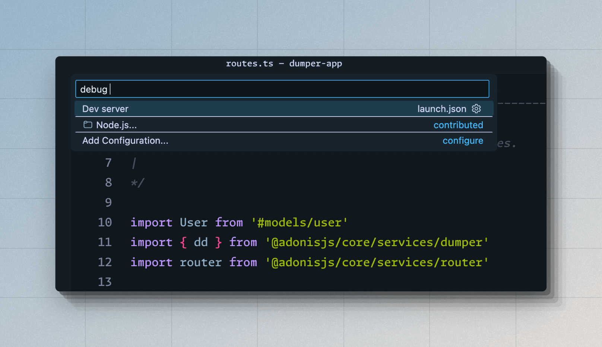

# デバッグ
このガイドでは、VSCodeデバッガーの使用からDump and Dieの使用、フレームワークのデバッグログの表示まで、AdonisJSアプリケーションのデバッグ方法を複数探ります。

## VSCodeデバッガーを使用してデバッグ
VSCodeデバッガーを使用してAdonisJSアプリケーションをデバッグするのは簡単です。`.vscode/launch.json`ファイルを作成し、Node.jsデバッガーを使用するだけです。

次の例では、AdonisJS開発サーバーをデバッグモードで開始し、VSCodeデバッガーをそれにアタッチするための設定を定義します。

参照: [VSCodeデバッグドキュメント](https://code.visualstudio.com/docs/editor/debugging)

```json
// title: .vscode/launch.json
{
  "version": "0.2.0",
  "configurations": [
    {
      "type": "node",
      "request": "launch",
      "name": "Dev server",
      "program": "${workspaceFolder}/ace.js",
      "args": ["serve", "--hmr"],
      "skipFiles": ["<node_internals>/**"]
    }
  ]
}
```

デバッグを開始するには:

- `(CMD + Shift + P)`でコマンドパレットを開きます。
- **Debug: Select and Start Debugging**を検索します。`.vscode/launch.json`ファイルからの起動オプションのリストが表示されます。
- **Dev server**オプションを選択して、VSCodeデバッガーでHTTPサーバーを実行します。



### テストのデバッグ

デバッグモードでテストを実行するための別の起動オプションを定義できます。

```json
// title: .vscode/launch.json
{
  "version": "0.2.0",
  "configurations": [
    {
      "type": "node",
      "request": "launch",
      "name": "Dev server",
      "program": "${workspaceFolder}/ace.js",
      "args": ["serve", "--hmr"],
      "skipFiles": ["<node_internals>/**"]
    },
    // insert-start
    {
      "type": "node",
      "request": "launch",
      "name": "Tests",
      "program": "${workspaceFolder}/ace.js",
      "args": ["test", "--watch"],
      "skipFiles": ["<node_internals>/**"]
    }
    // insert-end
  ]
}
```

### 他のすべてのAceコマンドのデバッグ
すべてのaceコマンドに対して個別の起動オプションを定義するのは実用的ではありません。したがって、`.vscode/launch.json`ファイル内に`attach`設定を定義できます。

`attach`モードでは、[VSCodeがデバッガーをアタッチします](https://code.visualstudio.com/blogs/2018/07/12/introducing-logpoints-and-auto-attach#_autoattaching-to-node-processes)が、VSCode統合ターミナルから`--inspect`フラグを使用してプロセスが開始された場合に限ります。

まず、`.vscode/launch.json`ファイルを変更し、次の設定を追加します。

```json
// title: .vscode/launch.json
{
  "version": "0.2.0",
  "configurations": [
    // insert-start
    {
      "type": "node",
      "request": "attach",
      "name": "Attach Program",
      "port": 9229,
      "autoAttachChildProcesses": true,
      "skipFiles": ["<node_internals>/**"]
    },
    // insert-end
    {
      "type": "node",
      "request": "launch",
      "name": "Dev server",
      "program": "${workspaceFolder}/ace.js",
      "args": ["serve", "--hmr"],
      "skipFiles": ["<node_internals>/**"]
    },
    {
      "type": "node",
      "request": "launch",
      "name": "Tests",
      "program": "${workspaceFolder}/ace.js",
      "args": ["test", "--watch"],
      "skipFiles": ["<node_internals>/**"]
    }
  ]
}
```

アタッチモードでデバッグを開始するには:

- `(CMD + Shift + P)`でコマンドパレットを開きます。
- **Debug: Select and Start Debugging**を検索します。`.vscode/launch.json`ファイルからの起動オプションのリストが表示されます。
- **Attach Program**オプションを選択します。
- `--inspect`フラグを使用してAceコマンドを実行します。例えば:
  ```sh
  node --inspect ace migration:run
  ```

::video{url="https://res.cloudinary.com/adonis-js/video/upload/v1726932262/n91xtzqavpdoro79lnza.mp4" controls="true"}


### Edgeテンプレートのデバッグ
EdgeテンプレートをTypeScriptで書かれたアプリケーションコードと同様にデバッグできます。ただし、EdgeではVSCodeが提供するブレークポイントを使用できません。代わりに、`@debugger`タグを使用してコード内ブレークポイントを定義する必要があります。

:::note

デバッガーはEdgeテンプレートのコンパイルされた出力を表示します。

:::

```edge
@debugger
```

## Dump and Die
Dump and Die（`dd`として知られる）は、もっとも愛されているデバッグ技術である`console.log`に似ています。ただし、`dd`ヘルパーは例外をスローして実行を停止し、ブラウザまたはターミナル内に出力を表示します。

HTTPリクエスト中に`dd`ヘルパーを使用すると、出力はHTMLドキュメントとしてレンダリングされます。それ以外の場合、出力はターミナル内に表示されます。

```ts
// title: start/routes.ts
import User from '#models/user'
import router from '@adonisjs/core/services/router'
// highlight-start
import { dd } from '@adonisjs/core/services/dumper'
// highlight-end

router.get('/users', async () => {
  const users = await User.all()
  // highlight-start
  /**
   * "/users"エンドポイントにアクセスしてダンプされた値を表示します
   */
  dd(users)
  // highlight-end
  return users
})
```

`dd`の出力は`console.log`を使用した場合と若干異なります。

- 値がダンプされたソースコードの場所を確認できます。
- クラスの静的プロパティとオブジェクトのプロトタイププロパティを表示できます。
- デフォルトでは、10レベル深くまでのネストされた値が表示されます。
- HTML出力のための複数のテーマをサポートしています。`nightOwl`、`catppuccin`、`minLight`から選択できます。


### Edgeテンプレートのデバッグ用ヘルパー
Edgeテンプレート内で`@dd`タグを使用して`dd`ヘルパーを使用できます。さらに、例外をスローせずにテンプレートの残りをレンダリングし続ける`@dump`ヘルパーも使用できます。

```edge
{{-- テンプレートの状態をダンプして停止 --}}
@dd(state)

{{-- テンプレートの状態をダンプしてレンダリングを続行 --}}
@dump(state)
```

### ダンパー設定
`config/app.ts`ファイル内でダンパー設定を構成できます。このファイルは、以下のように`dumper`設定オブジェクトをエクスポートする必要があります。

```ts
// title: config/app.ts
/**
 * "dd"ヘルパーによって使用されるグローバル設定。 "console"と"html"プリンターの両方の設定を個別に構成できます。
 */
export const dumper = dumperConfig({
  /**
   * コンソールプリンターの設定
   */
  console: {
    depth: 10,

    /**
     * さらに展開されるべきでないオブジェクト。配列はオブジェクトコンストラクタ名の配列を受け入れます。
     */
    collapse: ['DateTime', 'Date'],
    inspectStaticMembers: true,
  },

  /**
   * HTMLプリンターの設定
   */
  html: {
    depth: 10,
    inspectStaticMembers: true,
  },
})
```

<dl>

<dt> showHidden </dt>
<dd>

`true`に設定すると、オブジェクトの非列挙プロパティが処理されます。**デフォルト: `false`**

</dd>

<dt> depth </dt>
<dd>

ネストされた値の解析を停止する深さ。深さはすべてのツリー状データ構造（例えば、オブジェクト、配列、マップ、セット）で共有されます。**デフォルト: `5`**

</dd>

<dt> inspectObjectPrototype </dt>
<dd>

オブジェクトのプロトタイププロパティを検査します。プロトタイプの非列挙プロパティはデフォルトで含まれます。**デフォルト: `'unless-plain-object'`**。

- `true`に設定すると、すべてのオブジェクトのプロトタイププロパティが処理されます。
- `false`に設定すると、プロトタイププロパティは処理されません。
- `'unless-plain-object'`に設定すると、クラスインスタンスのプロトタイププロパティが処理されます。

</dd>

<dt> inspectArrayPrototype </dt>
<dd>

配列のプロトタイププロパティを検査します。**デフォルト: `false`**。

</dd>

<dt> inspectStaticMembers </dt>
<dd>

クラスの静的メンバーを検査します。関数とクラスは技術的には同じですが、この設定は`[class]`キーワードを使用して定義された関数にのみ適用されます。**デフォルト: `false`**。

</dd>

<dt> maxArrayLength </dt>
<dd>

`配列`、`マップ`、および`セット`のメンバーを処理する最大数。**デフォルト: `100`**。

</dd>

<dt> maxStringLength </dt>
<dd>

文字列を表示する最大文字数。**デフォルト: `1000`**。

</dd>

<dt> collapse </dt>
<dd>

さらに検査されるべきでないオブジェクトコンストラクタ名の配列。

</dd>

</dl>

## フレームワークのデバッグログ
`NODE_DEBUG`環境変数を使用してフレームワークのデバッグログを表示できます。`NODE_DEBUG`フラグはNode.jsランタイムによってサポートされており、モジュール名を使用して1つ以上のモジュールのログを表示できます。

例えば、`NODE_DEBUG="adonisjs:*"`値を使用してすべてのAdonisJSパッケージのログを表示できます。

```sh
NODE_DEBUG="adonisjs:*" node ace serve --hmr
```

同様に、`NODE_DEBUG`環境変数を使用して`fs`、`net`、`module`などのNode.jsネイティブモジュールからのログを表示できます。

```sh
NODE_DEBUG="adonisjs:*,net,fs" node ace serve --hmr
```

<!-- ## アクティビティの観察
アプリケーションのさまざまな部分によって実行されるアクションを観察することは、意味のある洞察を提供し、フレームワークの内部動作をデバッグおよび理解するのに役立ちます。

### Lucidクエリ
`config/database.ts`ファイル内で`debug`フラグを有効にすることで、Lucidクエリをデバッグできます。さらに、同じファイル内で`prettyPrintDebugQueries`を有効にして、ターミナルにSQLクエリを表示する必要があります。

```ts
// title: config/database.ts
const dbConfig = defineConfig({
  connection: 'sqlite',
  // insert-start
  prettyPrintDebugQueries: true,
  // insert-end
  connections: {
    sqlite: {
      client: 'better-sqlite3',
      connection: {
        filename: app.tmpPath('db.sqlite3'),
      },
      // insert-start
      debug: true,
      // insert-end
      useNullAsDefault: true,
      migrations: {
        naturalSort: true,
        paths: ['database/migrations'],
      },
    },
  },
})
```

 -->

<!-- ### 送信メール

### HTTPリクエスト -->
