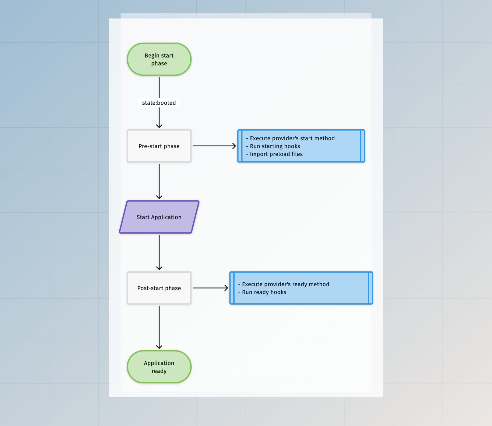
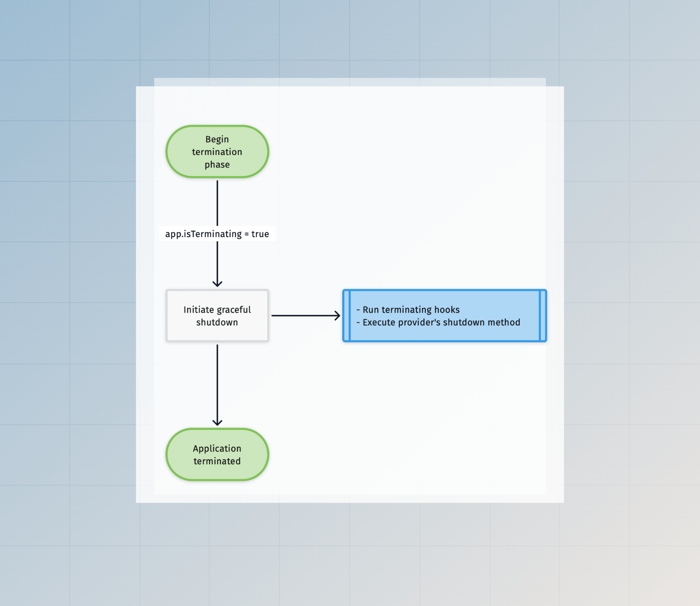

# アプリケーションのライフサイクル

このガイドでは、AdonisJSがアプリケーションを起動する方法と、アプリケーションが準備完了とみなされる前にアプリケーションの状態を変更するために使用できるライフサイクルフックについて学びます。

アプリケーションのライフサイクルは、実行される環境によって異なります。たとえば、HTTPリクエストを処理するために起動される長時間実行されるプロセスは、短時間実行されるaceコマンドとは異なる方法で管理されます。

それでは、サポートされているすべての環境についてアプリケーションのライフサイクルを理解しましょう。

## AdonisJSアプリケーションの起動方法
AdonisJSアプリケーションには複数のエントリーポイントがあり、各エントリーポイントは特定の環境でアプリケーションを起動します。次のエントリーポイントファイルは、`bin`ディレクトリ内に格納されています。

- `bin/server.ts`エントリーポイントは、HTTPリクエストを処理するためにAdonisJSアプリケーションを起動します。`node ace serve`コマンドを実行すると、このファイルがバックグラウンドで子プロセスとして実行されます。
- `bin/console.ts`エントリーポイントは、CLIコマンドを処理するためにAdonisJSアプリケーションを起動します。このファイルは、[Ace](../ace/introduction.md)を使用しています。
- `bin/test.ts`エントリーポイントは、Japaを使用してテストを実行するためにAdonisJSアプリケーションを起動します。

これらのファイルのいずれかを開くと、[Ignitor](https://github.com/adonisjs/core/blob/main/src/ignitor/main.ts#L23)モジュールを使用して設定を行い、アプリケーションを起動していることがわかります。

Ignitorモジュールは、AdonisJSアプリケーションの起動ロジックをカプセル化しています。内部では、次のアクションを実行します。

- [Application](https://github.com/adonisjs/application/blob/main/src/application.ts)クラスのインスタンスを作成します。
- アプリケーションを初期化/起動します。
- アプリケーションを起動するための主なアクションを実行します。たとえば、HTTPサーバーの場合、`main`アクションはHTTPサーバーの起動を行います。テストの場合、`main`アクションはテストの実行を行います。

[Ignitorのコードベース](https://github.com/adonisjs/core/tree/main/src/ignitor)は比較的シンプルなので、ソースコードを参照して詳細を理解してください。

## 起動フェーズ

起動フェーズは、`console`環境を除いてすべての環境で同じです。`console`環境では、実行されるコマンドによってアプリケーションの起動が決まります。

アプリケーションが起動された後にのみ、コンテナのバインディングとサービスを使用できます。


## 開始フェーズ

開始フェーズは、すべての環境で異なります。また、実行フローは以下のサブフェーズにさらに分割されます。

- `pre-start`フェーズは、アプリケーションの開始前に実行されるアクションを指します。

- `post-start`フェーズは、アプリケーションの開始後に実行されるアクションを指します。HTTPサーバーの場合、アクションはHTTPサーバーが新しい接続を受け付ける準備ができた後に実行されます。



### Web環境での動作

Web環境では、長時間実行されるHTTP接続が作成され、着信リクエストを待機し、アプリケーションはサーバーがクラッシュするかプロセスがシャットダウンするシグナルを受け取るまで`ready`状態になります。

### テスト環境での動作

テスト環境では、**pre-start**フェーズと**post-start**フェーズが実行されます。その後、テストファイルをインポートしてテストを実行します。

### コンソール環境での動作

`console`環境では、実行されるコマンドによってアプリケーションの起動が決まります。

コマンドは、`options.startApp`フラグを有効にすることでアプリケーションを起動できます。その結果、**pre-start**フェーズと**post-start**フェーズは、コマンドの`run`メソッドの前に実行されます。

```ts
import { BaseCommand } from '@adonisjs/core/ace'

export default class GreetCommand extends BaseCommand {
  static options = {
    startApp: true
  }
  
  async run() {
    console.log(this.app.isStarted) // true
  }
}
```

## 終了フェーズ

アプリケーションの終了は、短時間実行されるプロセスと長時間実行されるプロセスでは大きく異なります。

短時間実行されるコマンドまたはテストプロセスは、メインの操作が終了した後に終了処理を開始します。

長時間実行されるHTTPサーバープロセスは、`SIGTERM`などの終了シグナルを待機して終了処理を開始します。



### プロセスシグナルへの応答

すべての環境で、アプリケーションが`SIGTERM`シグナルを受け取ると、優雅なシャットダウンプロセスが開始されます。[pm2](https://pm2.keymetrics.io/docs/usage/signals-clean-restart/)を使用してアプリケーションを起動した場合、優雅なシャットダウンは`SIGINT`イベントを受け取った後に行われます。

### Web環境での動作

Web環境では、アンダーラインのHTTPサーバーがエラーでクラッシュするまでアプリケーションは実行され続けます。その場合、アプリケーションの終了処理が開始されます。

### テスト環境での動作

すべてのテストが実行された後、優雅な終了処理が開始されます。

### コンソール環境での動作

`console`環境では、アプリケーションの終了は実行されるコマンドに依存します。

コマンドが`options.staysAlive`フラグを有効にしている場合、コマンドが明示的にアプリケーションを終了するまでアプリケーションは終了しません。

```ts
import { BaseCommand } from '@adonisjs/core/ace'

export default class GreetCommand extends BaseCommand {
  static options = {
    startApp: true,
    staysAlive: true,
  }
  
  async run() {
    await runSomeProcess()
    
    // プロセスを終了する
    await this.terminate()
  }
}
```

## ライフサイクルフック

ライフサイクルフックを使用すると、アプリケーションのブートストラッププロセスにフックして、アプリケーションが異なる状態を経る間にアクションを実行できます。

サービスプロバイダクラスを使用してフックをリッスンするか、アプリケーションクラスにインラインで定義できます。

### インラインコールバック

アプリケーションインスタンスが作成された直後にライフサイクルフックを登録する必要があります。

エントリーポイントファイル`bin/server.ts`、`bin/console.ts`、`bin/test.ts`は、異なる環境用に新しいアプリケーションインスタンスを作成し、これらのファイル内でインラインコールバックを登録できます。

```ts
const app = new Application(new URL('../', import.meta.url))

new Ignitor(APP_ROOT, { importer: IMPORTER })
  .tap((app) => {
    // highlight-start
    app.booted(() => {
      console.log('アプリケーションが起動した後に呼び出されます')
    })
    
    app.ready(() => {
      console.log('アプリケーションが準備完了した後に呼び出されます')
    })
    
    app.terminating(() => {
      console.log('終了処理が開始される前に呼び出されます')
    })
    // highlight-end
  })
```

- `initiating`: `initiating`フックアクションは、アプリケーションが初期化状態に移行する前に呼び出されます。`adonisrc.ts`ファイルは、`initiating`フックを実行した後にパースされます。

- `booting`: `booting`フックアクションは、アプリケーションの起動前に呼び出されます。`booting`フックを実行した後に設定ファイルがインポートされます。

- `booted`: `booted`フックアクションは、すべてのサービスプロバイダが登録および起動された後に呼び出されます。

- `starting`: `starting`フックアクションは、プリロードファイルをインポートする前に呼び出されます。

- `ready`: `ready`フックアクションは、アプリケーションが準備完了した後に呼び出されます。

- `terminating`: `terminating`フックアクションは、優雅な終了プロセスが開始されると呼び出されます。たとえば、このフックではデータベース接続を閉じたり、オープンされたストリームを終了したりできます。

### サービスプロバイダを使用する

サービスプロバイダは、プロバイダクラスのメソッドとしてライフサイクルフックを定義します。インラインコールバックよりもサービスプロバイダを使用することをオススメします。サービスプロバイダを使用すると、すべてがきちんと整理されます。

以下は、使用可能なライフサイクルメソッドのリストです。

```ts
import { ApplicationService } from '@adonisjs/core/types'

export default class AppProvider {
  constructor(protected app: ApplicationService) {}
  
  register() {
  }
  
  async boot() {
  }
  
  async start() {
  }
  
  async ready() {
  }
  
  async shutdown() {
  }
}
```

- `register`: `register`メソッドは、コンテナ内でバインディングを登録します。このメソッドは同期的に実行されます。

- `boot`: `boot`メソッドは、コンテナ内で登録したバインディングを初期化または起動するために使用されます。

- `start`: `start`メソッドは、`ready`メソッドの直前に実行されます。`ready`フックアクションが必要とするアクションを実行できます。

- `ready`: `ready`メソッドは、アプリケーションが準備完了とみなされた後に実行されます。

- `shutdown`: `shutdown`メソッドは、アプリケーションが優雅なシャットダウンを開始したときに呼び出されます。このメソッドを使用してデータベース接続を閉じたり、オープンされたストリームを終了したりできます。
