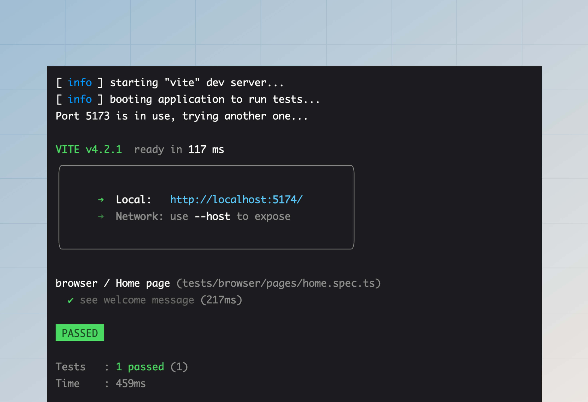

# Browser tests
Browser tests are executed inside real browsers like Chrome, Firefox, or Safari. We make use of [Playwright](https://playwright.dev/) (a browser automation tool) for interacting with webpages programmatically.

Playwright is both a testing framework and a library that exposes JavaScript APIs to interact with the browser. We **do not use the Playwright testing framework** because we are already using Japa, and using multiple testing frameworks inside a single project will only lead to confusion and config bloat.

Instead, we will use the [Browser Client](https://japa.dev/docs/plugins/browser-client) plugin from Japa, which integrates nicely with Playwright and offers a great testing experience.

## Setup
The first step is to install the following packages from the npm packages registry.

:::codegroup

```sh
// title: npm
npm i -D playwright @japa/browser-client
```

```sh
// title: yarn
yarn add -D playwright @japa/browser-client
```

```sh
// title: pnpm
pnpm add -D playwright @japa/browser-client
```

:::

### Registering browser suite
Let's start by creating a new test suite for browser tests inside the `adonisrc.ts` file. The test files for the browser suite will be stored inside the `tests/browser` directory.

```ts
{
  tests: {
    suites: [
      // highlight-start
      {
        files: [
          'tests/browser/**/*.spec(.ts|.js)'
        ],
        name: 'browser',
        timeout: 300000
      }
      // highlight-end
    ]
  }
}
```

### Configuring the plugin
Before you can start writing tests, you must register the `browserClient` plugin within the `tests/bootstrap.ts` file.

```ts
import { browserClient } from '@japa/browser-client'

export const plugins: Config['plugins'] = [
  assert(),
  apiClient(),
  // highlight-start
  browserClient({
    runInSuites: ['browser']
  }),
  // highlight-end
  pluginAdonisJS(app)
]
```

## Basic example
Let's create an example test that will open the home page of your AdonisJS application and verifies the contents of the page. The [`visit`](https://japa.dev/docs/plugins/browser-client#browser-api) helper opens a new page and visits a URL. The return value is the [page object](https://playwright.dev/docs/api/class-page).

See also: [List of assertions methods](https://japa.dev/docs/plugins/browser-client#assertions)

```sh
node ace make:test pages/home --suite=browser
# DONE:    create tests/browser/pages/home.spec.ts
```

```ts
// title: tests/browser/pages/home.spec.ts
import { test } from '@japa/runner'

test.group('Home page', () => {
  test('see welcome message', async ({ visit }) => {
    const page = await visit('/')
    await page.assertTextContains('body', 'It works!')
  })
})
```

Finally, let's run the above test using the `test` command. You may use the `--watch` flag to create a file watcher and re-run tests on every file change.

```sh
node ace test browser
```



## Reading/writing cookies
When testing inside a real browser, the cookies are persisted throughout the lifecycle of a [browser context](https://playwright.dev/docs/api/class-browsercontext). 

Japa creates a fresh browser context for each test, therefore the cookies from one test will not leak onto other tests. However, multiple page visits inside a single test will share the cookies, because they are using the same `browserContext`.

```ts
test.group('Home page', () => {
  test('see welcome message', async ({ visit, browserContext }) => {
    // highlight-start
    await browserContext.setCookie('username', 'virk')
    // highlight-end
    
    // The "username" cookie will be sent during the request
    const homePage = await visit('/')

    // The "username" cookie will also be sent during this request
    const aboutPage = await visit('/about')
  })
})
```

Similarly, the cookies set by the server can be accessed using the `browserContext.getCookie` method.

```ts
import router from '@adonisjs/core/services/router'

router.get('/', async ({ response }) => {
  // highlight-start
  response.cookie('cartTotal', '100')
  // highlight-end

  return 'It works!'
})
```

```ts
test.group('Home page', () => {
  test('see welcome message', async ({ visit, browserContext }) => {
    const page = await visit('/')
    // highlight-start
    console.log(await browserContext.getCookie('cartTotal'))
    // highlight-end
  })
})
```

You may use the following methods to read/write encrypted and plain cookies.

```ts
// Write
await browserContext.setEncryptedCookie('username', 'virk')
await browserContext.setPlainCookie('username', 'virk')

// Read
await browserContext.getEncryptedCookie('cartTotal')
await browserContext.getPlainCookie('cartTotal')
```

## The route helper
You may use the `route` helper from the TestContext to create a URL for a route. Using the route helper ensures that whenever you update your routes, you do not have to come back and fix all the URLs inside your tests.

The `route` helper accepts the same set of arguments accepted by the global template method [route](../http/url_builder.md#route).

```ts
test('see list of users', ({ visit, route }) => {
  const page = await visit(
    // highlight-start
    route('users.list')
    // highlight-end
  )
})
```
